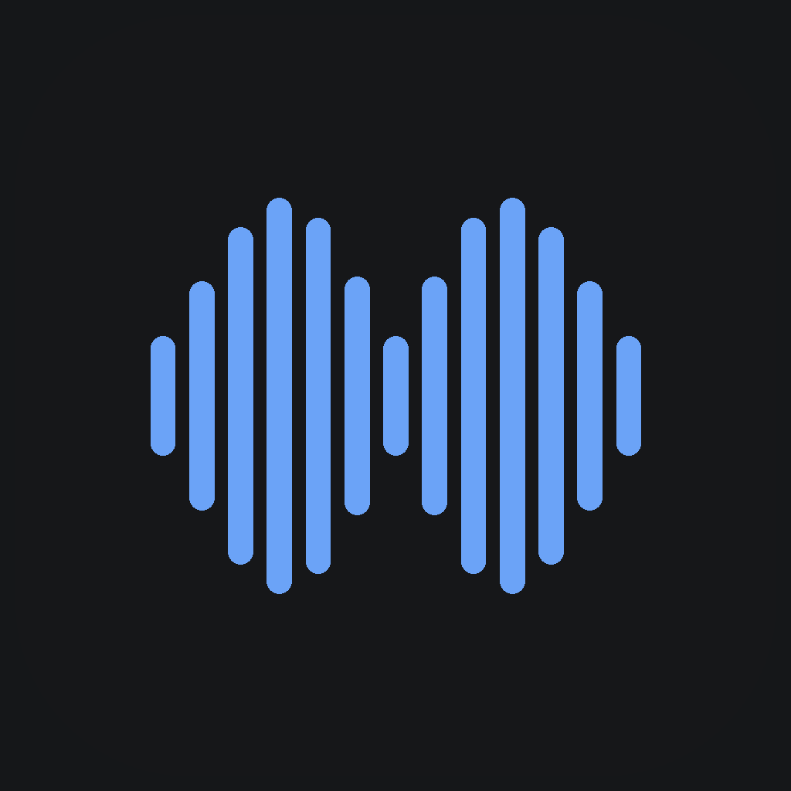

<p align="center">
  
</p>

<h1 align="center">Muesli for Android</h1>

<p align="center">
  <strong>Local-first voice notes and meeting transcription for Android</strong><br>
  On-device speech-to-text | Dictation keyboard | Private by default
</p>

<p align="center">
  <a href="LICENSE"></a>
  <a href="https://github.com/Muesli-HQ/muesli-android/actions/workflows/ci.yml"></a>
  
  
</p>

---

if you want early access - email me at pranav@muesli.works

## What is Muesli for Android?

Muesli for Android is the Android companion to [Muesli for macOS](https://github.com/Muesli-HQ/muesli) and [Muesli for iOS](https://github.com/Muesli-HQ/muesli-ios). It brings the same local-first product philosophy to Android: record speech, transcribe it on device with a quantized Parakeet model, and keep audio and transcripts local unless you explicitly choose otherwise.

The Android app shares its design language, transcription model family, and product structure with the iOS app, but is built around Android-native workflows:

- **Voice notes app** for recording, transcribing, copying, and sharing speech, with usage stats and history.
- **Dictation keyboard (IME)** for voice typing into any text field in any app, with a live waveform, press-and-hold key repeat, and a globe key to switch back to QWERTY keyboards.
- **Meeting recorder** for offline conversations: foreground recording with chunked on-device transcription, retained audio, note templates, and searchable history.

This repository is suitable for source review, local development, and device testing. End-user distribution (Play Store / sideloaded releases) is not set up yet.

---

## Features

- **On-device transcription** — NVIDIA Parakeet TDT 0.6B v3 (int8, ~620 MB) runs locally through [sherpa-onnx](https://github.com/k2-fsa/sherpa-onnx) / ONNX Runtime; audio never needs to leave the phone for transcription. Multilingual, punctuation-aware — the same Parakeet model family as Muesli for iOS.
- **Live dictation waveform** — real-time mic-driven waveform during recording, ported bar-for-bar from the iOS implementation, plus an elapsed-time badge.
- **Dictation keyboard** — a dictation-only input method: start/stop with live partial results, automatic filler-word removal and custom-dictionary replacements, then insert into the active text field. Works in any app.
- **Quick capture (Android-exclusive)** — a draggable floating bubble that lives over other apps: tap to dictate into a compact overlay card; the note is saved and copied to the clipboard. Also available as a Quick Settings tile and a home-screen widget. Enable from **Settings → Voice Notes → Quick Capture**.
- **Keep mic ready** — optional session mode: the keyboard starts listening as soon as it opens.
- **Meeting recorder** — a foreground service records meetings (with an ongoing notification + stop/discard actions), segments speech with a bundled Silero VAD and decodes each segment through Parakeet for live local transcription, then diarizes the finished recording on-device into speaker-labeled transcripts (pyannote + TitaNet, bundled).
- **Meeting templates** — seven note templates ported from iOS (General, 1:1, Standup, Interview, Lecture, Customer Call, Planning).
- **Meeting detail** — selectable transcript, manual notes with auto-save, share sheet, and status tracking (recording/completed/failed/cancelled).
- **Personal dictionary** — custom words with Jaro-Winkler fuzzy matching, phrase replacements, and filler-word filtering applied to both dictation and meeting transcripts.
- **Usage stats** — streak, total words, words-per-minute, and meeting counts computed from local history.
- **iOS design parity** — the official Muesli app icon, MuesliTheme design tokens, glass-pill navigation, dark/light mode, and Blue/Green/Slate accent themes.
- **Model catalog** — pick between Parakeet v3 600M (multilingual, transducer) and Parakeet 110M (English, CTC); resumable, cancellable downloads (incl. tar.bz2 extraction), with progress and disk-usage display.
- **Local storage first** — all data lives in Room/SQLite and SharedPreferences on device. There is no account and no backend.

---

## Install

### From source (currently the only way)

**Requirements**

- JDK 17+ (JDK 21 recommended)
- Android SDK: platform `android-36` and build-tools
- An Android 7.0+ device or emulator (arm64 for the bundled native libraries)
- ~700 MB free space on the device for the transcription model

```bash
git clone https://github.com/Muesli-HQ/muesli-android.git
cd muesli-android

# Point Gradle at your SDK (or export ANDROID_HOME)
echo "sdk.dir=$HOME/Library/Android/sdk" > local.properties   # macOS example

./gradlew assembleDebug
adb install -r app/build/outputs/apk/debug/app-debug.apk
```

On first launch, complete onboarding (name + microphone permission), then go to **Settings → Models** and download the Parakeet V3 model (~638 MB, resumable). Dictation and meetings work fully offline after that.

Optional: enable the **Muesli Dictation Keyboard** from onboarding or **Settings → Voice Notes → Keyboard setup**, then switch to it from any text field using the system keyboard picker (globe key).

---

## Permissions

Muesli for Android asks only for permissions needed by the selected workflow.

| Permission | Why |
|---|---|
| **Microphone** | Record speech for voice notes, meetings, and keyboard dictation |
| **Notifications** | Show the ongoing meeting-recording notification with stop/discard actions (Android 13+) |
| **Foreground service (microphone)** | Keep meeting recording alive with the screen off |
| **Internet** | Download the on-device model from HuggingFace (one time); nothing else is transmitted |
| **Input method binding** | Offer the Muesli Dictation Keyboard system-wide |

Unlike iOS (where the keyboard extension hands off to the app), the Android keyboard currently records and transcribes **in its own process**, holding its own copy of the model in memory. An app-mediated handoff is planned for low-RAM devices.

---

## Architecture

```text
app/src/main/java/com/phequals7/muesli/
  MainActivity + Navigation      Compose entry, onboarding gate, dashboard host

  engine/                        TranscriptionEngine interface + implementations:
                                   SherpaOnnxEngine (Parakeet, AudioRecord capture,
                                   pseudo-live partials, RMS metering),
                                   SystemSpeechRecognizerEngine, MockTranscriptionEngine

  meetings/                      MeetingRecordingController (shared state bridge),
                                   MeetingRecorderService (foreground capture,
                                   30s chunk rotation → Parakeet decode, WAV writer,
                                   notification actions), MeetingTemplates

  ime/                           MuesliInputMethodService (dictation-only IME),
                                   KeyboardController (state machine, text insertion,
                                   key repeat, IME picker), iOS-parity keyboard UI

  model/                         ModelManager — resumable HuggingFace download of the
                                   Parakeet V3 model files with progress reporting

  data/                          Room database (dictations, sessions, transcripts,
                                   custom words), SharedStore facade, SharedPreferences

  ui/                            Dashboard (voice notes / meetings / settings tabs),
                                   iOS-parity components: MuesliInlineWaveform,
                                   glass-pill navigation, surface cards

  theme/                         MuesliColors (ported from muesli-ios MuesliTheme.swift),
                                   typography, accent themes, AppearanceController

app/src/main/java/com/k2fsa/sherpa/onnx/   Vendored sherpa-onnx Kotlin bindings (v1.13.4)
app/src/main/jniLibs/arm64-v8a/            Prebuilt sherpa-onnx + ONNX Runtime native libs
```

The meeting pipeline is:

1. `AudioRecord` captures 16 kHz mono float audio (and writes 16-bit PCM WAV when retention is on).
2. Every 30 seconds the accumulated chunk is queued for Parakeet decode; a final partial chunk is decoded on stop.
3. Chunk transcripts are post-processed (filler words, custom dictionary) and merged into the meeting transcript.
4. Session lifecycle (`recording → completed / cancelled / failed`) and audio are persisted in Room.

VAD-driven chunking (Silero via sherpa-onnx) and post-hoc speaker diarization are the planned upgrades — both models are already supported by the bundled runtime.

---

## Tech Stack

| Component | Technology |
|---|---|
| App | Kotlin, Jetpack Compose (Material 3), Room |
| Keyboard | InputMethodService with Compose-hosted UI |
| Local ASR | [sherpa-onnx](https://github.com/k2-fsa/sherpa-onnx) 1.13.4, Parakeet TDT 0.6B v3 (int8) via ONNX Runtime |
| Meeting capture | Foreground service, AudioRecord, WAV retention |
| Storage | Room (SQLite) + SharedPreferences |
| Model delivery | Direct download from HuggingFace (resumable) |
| Build | Gradle 9 (Kotlin DSL), AGP 9, KSP |
| Tests | JUnit 4 unit tests (text processing pipeline) |

---

## Repository Status

Muesli for Android is early-stage software. The current repo proves:

- the on-device Parakeet dictation loop (voice notes + keyboard IME);
- end-to-end meeting recording → chunked transcription → review;
- iOS design parity across theme, waveform, navigation, and settings structure;
- fully local operation with a clean permissions story.

Active gaps and roadmap, roughly in priority order:

- **AI meeting summaries** (OpenRouter BYOK, iOS parity)
- **Speaker diarization** and VAD-based chunking (sherpa-onnx Silero + segmentation models)
- **Meeting audio playback** and waveform scrubbing of retained WAVs
- **CI** (GitHub Actions: assemble + unit tests)
- **Sync** between devices (design open — iCloud does not exist on Android)
- **Play Store / signed release** distribution

---

## Development

Build and install to a connected device:

```bash
./gradlew assembleDebug
adb install -r app/build/outputs/apk/debug/app-debug.apk
```

Run the unit test suite:

```bash
./gradlew testDebugUnitTest
```

Notes for contributors:

- The sherpa-onnx Kotlin bindings are vendored under `com.k2fsa.sherpa.onnx` (tag `v1.13.4`); the matching prebuilt arm64 native libraries live in `app/src/main/jniLibs`. To support emulators/other ABIs, fetch the remaining ABIs from the sherpa-onnx release archive.
- Room migrations are explicit (`AppDatabase.kt`); avoid relying on `fallbackToDestructiveMigration` for user-facing schema changes.
- UI colors/type/spacing must come from `theme/` tokens — keep hex values in sync with `muesli-ios` `Shared/MuesliTheme.swift`.

---

## Privacy

Muesli's default design is local-first:

- audio is recorded and transcribed entirely on device;
- the transcription model is downloaded once from HuggingFace — after that, no network traffic is required for any feature;
- saved voice notes, meetings, and WAVs stay in app-private storage;
- there is no account, no backend, no analytics, and no crash reporting in the current build;
- the keyboard only writes text into the field you are editing; it does not read other fields or transmit anything.

---

## Related

- [Muesli for macOS](https://github.com/Muesli-HQ/muesli)
- [Muesli for iOS](https://github.com/Muesli-HQ/muesli-ios)
- [sherpa-onnx](https://github.com/k2-fsa/sherpa-onnx)
- [ONNX Runtime](https://github.com/microsoft/onnxruntime)
- [NVIDIA NeMo / Parakeet](https://github.com/NVIDIA/NeMo)

---

## Contributing

Issues and pull requests are welcome. For larger changes, please open an issue first so implementation details can be discussed against the Android architecture and the iOS feature-parity roadmap.

Before opening a PR:

```bash
./gradlew assembleDebug testDebugUnitTest
```

---

## License

Muesli for Android is released under the [MIT License](LICENSE). The vendored sherpa-onnx bindings retain their original Apache-2.0 license; ONNX Runtime is MIT; Parakeet models are provided by NVIDIA NeMo — see their respective licenses.
